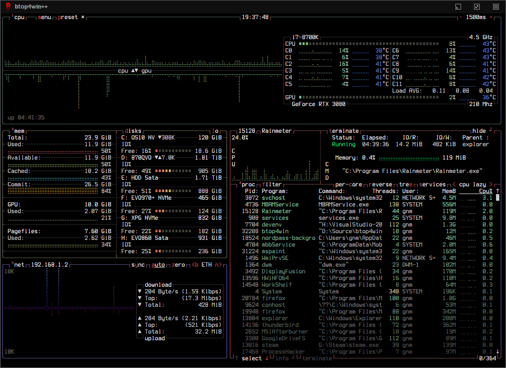
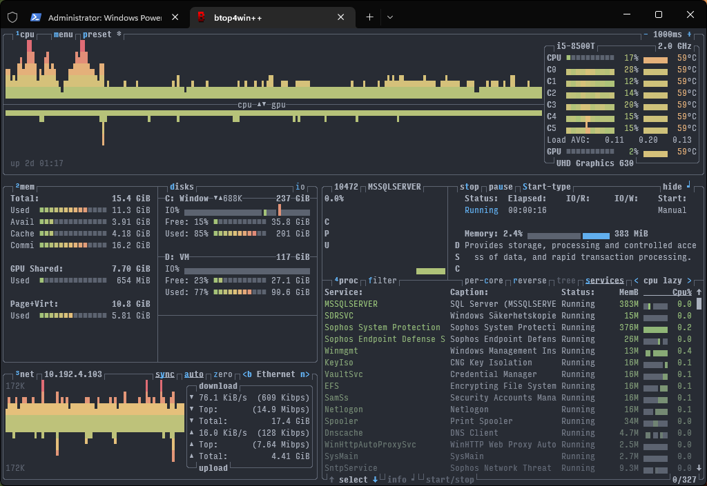
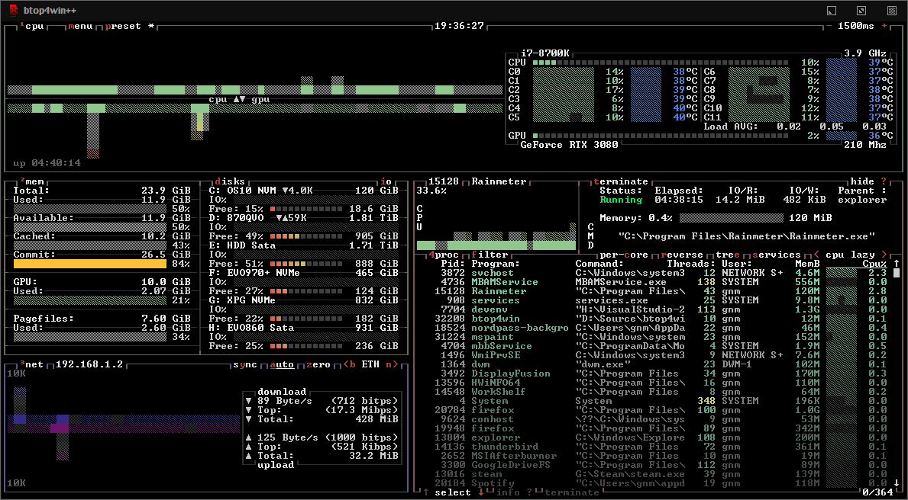
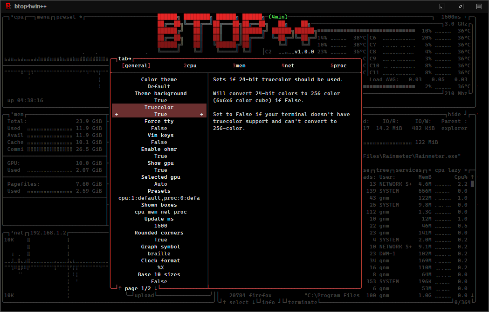
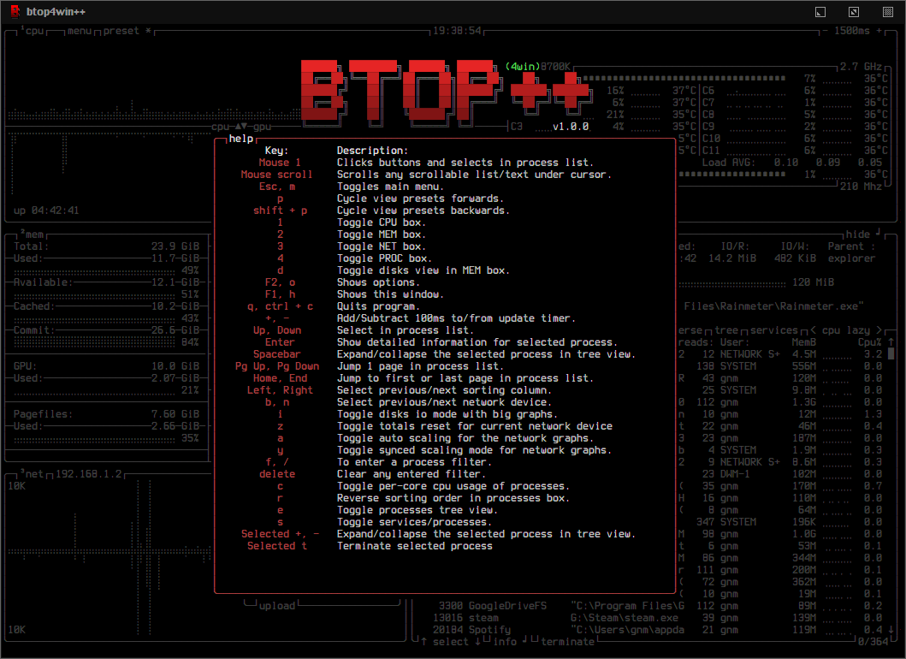

# 


[](https://paypal.me/aristocratos)
[](https://github.com/sponsors/aristocratos)
[](https://ko-fi.com/aristocratos)


## Index

* [News](#news)
* [Documents](#documents)
* [Description](#description)
* [Features](#features)
* [Themes](#themes)
* [Support and funding](#support-and-funding)
* [Prerequisites](#prerequisites) (Read this if you are having issues!)
* [Screenshots](#screenshots)
* [Keybindings](#help-menu)
* [Installation](#installation)
* [Compilation](#compilation)
* [Configurability](#configurability)
* [License](#license)

## News

##### 29 August 2022

Release v1.0.1

Changed from using OpenHardwareMonitor to LibreHardwareMonitor and using an intermediary DLL to export functions directly into btop4win.

Made some fixes for detecting GPU memory on integrated GPU's and overall detection for Ryzen Mobile chips.

The 2 available packages are now:

* btop4win:

    Has no support for GPU monitoring, CPU temperature monitoring and does not have accurate CPU clock monitoring.
    
    Does not require admin rights to run. (But it's still higly recommended to run as admin, otherwise some process information will be missing.)

* btop4win-LHM

    Has full GPU monitoring, etc. using Libre Hardware Monitor, DLL's included in the package, ([source](https://github.com/aristocratos/LHM-CppExport)).

    Requires admin rights to run.

##### 28 August 2022

Release of btop4win v1.0.0

There are 2 packages to choose from in the releases: btop4win and btop4win-OHMR.

* btop4win:

    Has no support for GPU monitoring, CPU temperature monitoring and does not have accurate CPU clock monitoring. But it does not require admin rights to run.

* btop4win-OHMR:

    Has full GPU monitoring, etc. using a modified version of Open Hardware Monitor Report included in the package, ([source](https://github.com/aristocratos/openhardwaremonitor)).

    It does however requires admin rights to run.

    It currently works by messaging by a text file which isn't ideal.

    Ideas and code contributions for optimizing the communication between the C# code of Open Hardware Monitor Report and the C++ code of btop4win are very welcome!

##### 27 Mars 2022

Started working on btop4win...

<details>
<summary>More...</summary>

Nothing here...

</details>

## Documents

**[CHANGELOG.md](CHANGELOG.md)**

**[CONTRIBUTING.md](CONTRIBUTING.md)**

**[CODE_OF_CONDUCT.md](CODE_OF_CONDUCT.md)**

## Description

Resource monitor that shows usage and stats for processor, memory, disks, network, processes and services.

Windows version of [btop++](https://github.com/aristocratos/btop) which is the C++ version and continuation of [bashtop](https://github.com/aristocratos/bashtop) and [bpytop](https://github.com/aristocratos/bpytop).

Needs Windows 10 version 1607 (Anniversary Update) for ANSI escape sequences to work in the standard terminal (CMD).

Will run on Windows 7 or later but requires custom terminal software that supports ANSI escape sequences.

Notes:

The default symbols for graphs are set to TTY by default for best compatibility with Windows CMD fonts, for braille and block symbols get custom fonts.

See [Cascadia Code](https://github.com/microsoft/cascadia-code) for a font that includes the braille symbols.

A recommended terminal if you're not running Windows 11 (Where it's included by default): [Windows Terminal](https://github.com/microsoft/terminal)

## Features

* Easy to use, with a game inspired menu system.
* Full mouse support, all buttons with a highlighted key is clickable and mouse scroll works in process list and menu boxes.
* Fast and responsive UI with UP, DOWN keys process selection.
* Function for showing detailed stats for selected process/service.
* Ability to filter processes/services.
* Easy switching between sorting options.
* Tree view of processes.
* Terminate processes.
* Start/stop/pause/continue services
* Set start-type for services
* UI menu for changing all config file options.
* Auto scaling graph for network usage.
* Shows IO activity and speeds for disks
* Battery meter
* Selectable symbols for the graphs
* Custom presets
* And more...

## Themes

Btop4win++ uses the same theme files as btop++, bpytop and bashtop (some color values missing in bashtop themes) .

See [themes](https://github.com/aristocratos/btop/tree/master/themes) folder for available themes.

Themes are located in the themes folder in the same location as btop4win.exe.

Let me know if you want to contribute with new themes.

## Support and funding

You can sponsor this project through github, see [my sponsors page](https://github.com/sponsors/aristocratos) for options.

Or donate through [paypal](https://paypal.me/aristocratos) or [ko-fi](https://ko-fi.com/aristocratos).

Any support is greatly appreciated!

## Prerequisites

For best experience, a terminal with support for:

* 24-bit truecolor
* 256-color terminals are supported through 24-bit to 256-color conversion when setting "truecolor" to False in the options or with "-lc/--low-color" arguments.
* 16 color TTY mode will be activated if a real tty device is detected. Can be forced with "-t/--tty_on" arguments.
* Wide characters (Are sometimes problematic in web-based terminals)

Also needs a UTF8 locale and a font that covers:

* Unicode Block “Braille Patterns” U+2800 - U+28FF (Not needed in TTY mode or with graphs set to type: block or tty.)
* Unicode Block “Geometric Shapes” U+25A0 - U+25FF
* Unicode Block "Box Drawing" and "Block Elements" U+2500 - U+259F

* Recommended: [The new Windows Terminal](https://github.com/microsoft/terminal)

### **Notice (Text rendering issues)**

* If you are having problems with the characters in the graphs not looking like they do in the screenshots, it's likely a problem with your font not having support for some characters used (braille characters etc.).

* See [Cascadia Code](https://github.com/microsoft/cascadia-code) or [Terminess Powerline](https://github.com/ryanoasis/nerd-fonts/tree/master/patched-fonts/Terminus/terminus-ttf-4.40.1) for examples of fonts that includes the needed symbols.

## Screenshots

#### Main UI showing details for a selected process, font: [Terminess Powerline](https://github.com/ryanoasis/nerd-fonts/tree/master/patched-fonts/Terminus/terminus-ttf-4.40.1)



#### Main UI showing details for a selected service, font [Input Mono Compressed](https://input.djr.com), theme OneDark



#### Main UI with TTY graph symbols using CMD Raster fonts



#### Options-menu



#### Help-menu



## Installation

1. Make sure you have the latest MSVC Runtime Libraries installed: https://aka.ms/vs/17/release/vc_redist.x64.exe

2. Download package of choice from latest [release](https://github.com/aristocratos/btop4win/releases/latest)

3. Extract the btop4win folder anywhere and run btop4win.exe.

## Compilation

1. (Optional) For compiling with LibreHardwareMonitor support:

    * Either download latest release from https://github.com/aristocratos/LHM-CppExport and place the "external" folder in btop4win top folder, or:

    * 1. Clone https://github.com/aristocratos/LHM-CppExport and open the solution

    * 2. Build Release x64 configuration for CPPdll

    * 3. Copy all .dll and .lib files from "x64/Release" to "external" folder in top-level of btop4win

2. btop4win

    * 1. Clone the repository or download source package from latest release.

    * 2. Open solution with Visual Studio 2022.

    * 3. Choose between Debug, Release and Release-LHM configurations.

    * * (Release-LHM sets admin requirement on the binary, LHM_Enabled declaration and needs LHM-CppExport dll's and .lib in "external" folder).

    * 4. Build solution.

## Configurability

All options changeable from within UI.
Config and log files stored in same folder as btop4win.exe

#### btop.conf: (auto generated if not found)

```bash
#? Config file for btop4win v. 1.0.0

#* Name of a btop++/bpytop/bashtop formatted ".theme" file, "Default" and "TTY" for builtin themes.
#* Themes should be placed in "themes" folder in same folder as btop4win.exe
color_theme = "Default"

#* If the theme set background should be shown, set to False if you want terminal background transparency.
theme_background = True

#* Sets if 24-bit truecolor should be used, will convert 24-bit colors to 256 color (6x6x6 color cube) if false.
truecolor = True

#* Set to true to force tty mode regardless if a real tty has been detected or not.
#* Will force 16-color mode and TTY theme, set all graph symbols to "tty" and swap out other non tty friendly symbols.
force_tty = False

#* Define presets for the layout of the boxes. Preset 0 is always all boxes shown with default settings. Max 9 presets.
#* Format: "box_name:P:G,box_name:P:G" P=(0 or 1) for alternate positions, G=graph symbol to use for box.
#* Use withespace " " as separator between different presets.
#* Example: "cpu:0:default,mem:0:tty,proc:1:default cpu:0:braille,proc:0:tty"
presets = "cpu:1:default,proc:0:default cpu:0:default,mem:0:default,net:0:default cpu:0:block,net:0:tty"

#* Set to True to enable "h,j,k,l,g,G" keys for directional control in lists.
#* Conflicting keys for h:"help" and k:"kill" is accessible while holding shift.
vim_keys = False

#* Enables monitoring of CPU temps, accurate CPU clock and GPU via Open Hardware Monitor Report.
#* Needs the btop modified fork (https://github.com/aristocratos/openhardwaremonitor) installed in OHMR folder where btop is installed.
enable_ohmr = True

#* Also show gpu stats in cpu and mem box. Needs Open Hardware Monitor Report enabled.
show_gpu = True

#* Which GPU to display if multiple is detected.
selected_gpu = "Auto"

#* Rounded corners on boxes, is ignored if TTY mode is ON.
rounded_corners = False

#* Default symbols to use for graph creation, "braille", "block" or "tty".
#* "braille" offers the highest resolution but might not be included in all fonts.
#* "block" has half the resolution of braille but uses more common characters.
#* "tty" uses only 3 different symbols but will work with most fonts and should work in a real TTY.
#* Note that "tty" only has half the horizontal resolution of the other two, so will show a shorter historical view.
graph_symbol = "tty"

# Graph symbol to use for graphs in cpu box, "default", "braille", "block" or "tty".
graph_symbol_cpu = "default"

# Graph symbol to use for graphs in cpu box, "default", "braille", "block" or "tty".
graph_symbol_mem = "default"

# Graph symbol to use for graphs in cpu box, "default", "braille", "block" or "tty".
graph_symbol_net = "default"

# Graph symbol to use for graphs in cpu box, "default", "braille", "block" or "tty".
graph_symbol_proc = "default"

#* Manually set which boxes to show. Available values are "cpu mem net proc", separate values with whitespace.
shown_boxes = "cpu mem net proc"

#* Update time in milliseconds, recommended 2000 ms or above for better sample times for graphs.
update_ms = 1500

#* Processes sorting, "pid" "program" "arguments" "threads" "user" "memory" "cpu lazy" "cpu direct",
#* "cpu lazy" sorts top process over time (easier to follow), "cpu direct" updates top process directly.
proc_sorting = "cpu lazy"

#* Show services in the process box instead of processes.
proc_services = False

#* Services sorting, "service" "caption" "status" "memory" "cpu lazy" "cpu direct",
#* "cpu lazy" sorts top service over time (easier to follow), "cpu direct" updates top service directly.
services_sorting = "cpu lazy"

#* Reverse sorting order, True or False.
proc_reversed = False

#* Show processes as a tree.
proc_tree = False

#* Use the cpu graph colors in the process list.
proc_colors = True

#* Use a darkening gradient in the process list.
proc_gradient = True

#* If process cpu usage should be of the core it's running on or usage of the total available cpu power.
proc_per_core = False

#* Show process memory as bytes instead of percent.
proc_mem_bytes = True

#* Show proc box on left side of screen instead of right.
proc_left = False

#* Sets the CPU stat shown in upper half of the CPU graph, "total" is always available.
#* Select from a list of detected attributes from the options menu.
cpu_graph_upper = "total"

#* Sets the CPU stat shown in lower half of the CPU graph, "total" is always available.
#* Select from a list of detected attributes from the options menu.
cpu_graph_lower = "gpu"

#* Toggles if the lower CPU graph should be inverted.
cpu_invert_lower = True

#* Set to True to completely disable the lower CPU graph.
cpu_single_graph = False

#* Show cpu box at bottom of screen instead of top.
cpu_bottom = False

#* Shows the system uptime in the CPU box.
show_uptime = True

#* Show cpu temperature.
check_temp = True

#* Which sensor to use for cpu temperature, use options menu to select from list of available sensors.
cpu_sensor = 

#* Show temperatures for cpu cores also if check_temp is True and sensors has been found.
show_coretemp = True

#* Which temperature scale to use, available values: "celsius", "fahrenheit", "kelvin" and "rankine".
temp_scale = "celsius"

#* Use base 10 for bits/bytes sizes, KB = 1000 instead of KiB = 1024.
base_10_sizes = False

#* Draw a clock at top of screen, formatting according to strftime, empty string to disable.
#* Special formatting: /host = hostname | /user = username | /uptime = system uptime
clock_format = "%X"

#* Update main ui in background when menus are showing, set this to false if the menus is flickering too much for comfort.
background_update = True

#* Custom cpu model name, empty string to disable.
custom_cpu_name = ""

#* Optional filter for shown disks, should be full path of a mountpoint, separate multiple values with whitespace " ".
#* Begin line with "exclude=" to change to exclude filter, otherwise defaults to "most include" filter. Example: disks_filter="exclude=D:\ E:\".
disks_filter = ""

#* Show graphs instead of meters for memory values.
mem_graphs = True

#* Show mem box below net box instead of above.
mem_below_net = False

#* If page memory should be shown in memory box.
show_page = True

#* If mem box should be split to also show disks info.
show_disks = True

#* Filter out non physical disks. Set this to False to include network disks, RAM disks and similar.
only_physical = True

#* Set to true to show available disk space for privileged users.
disk_free_priv = False

#* Toggles if io activity % (disk busy time) should be shown in regular disk usage view.
show_io_stat = True

#* Toggles io mode for disks, showing big graphs for disk read/write speeds.
io_mode = False

#* Set to True to show combined read/write io graphs in io mode.
io_graph_combined = False

#* Set the top speed for the io graphs in MiB/s (100 by default), use format "mountpoint:speed" separate disks with whitespace " ".
#* Example: "/mnt/media:100 /:20 /boot:1".
io_graph_speeds = ""

#* Set fixed values for network graphs in Mebibits. Is only used if net_auto is also set to False.
net_download = 100

net_upload = 100

#* Use network graphs auto rescaling mode, ignores any values set above and rescales down to 10 Kibibytes at the lowest.
net_auto = True

#* Sync the auto scaling for download and upload to whichever currently has the highest scale.
net_sync = False

#* Starts with the Network Interface specified here.
net_iface = ""

#* Show battery stats in top right if battery is present.
show_battery = True

#* Set loglevel for "~/.config/btop/btop.log" levels are: "ERROR" "WARNING" "INFO" "DEBUG".
#* The level set includes all lower levels, i.e. "DEBUG" will show all logging info.
log_level = "WARNING"
```

#### Command line options

```text
usage: btop4win.exe [-h] [-v] [-/+t] [-p <id>] [--debug]

optional arguments:
  -h, --help            show this help message and exit
  -v, --version         show version info and exit
  -lc, --low-color      disable truecolor, converts 24-bit colors to 256-color
  -t, --tty_on          force (ON) tty mode, max 16 colors and tty friendly graph symbols
  +t, --tty_off         force (OFF) tty mode
  -p, --preset <id>     start with preset, integer value between 0-9
  --debug               start in DEBUG mode: shows microsecond timer for information collect
                        and screen draw functions and sets loglevel to DEBUG
```

## LICENSE

[Apache License 2.0](LICENSE)
